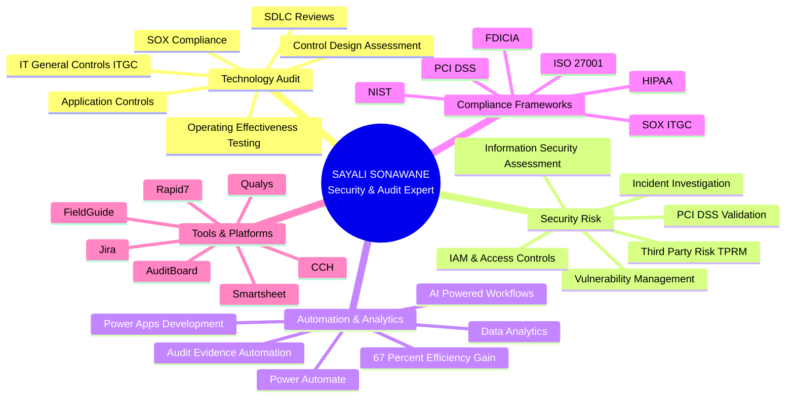
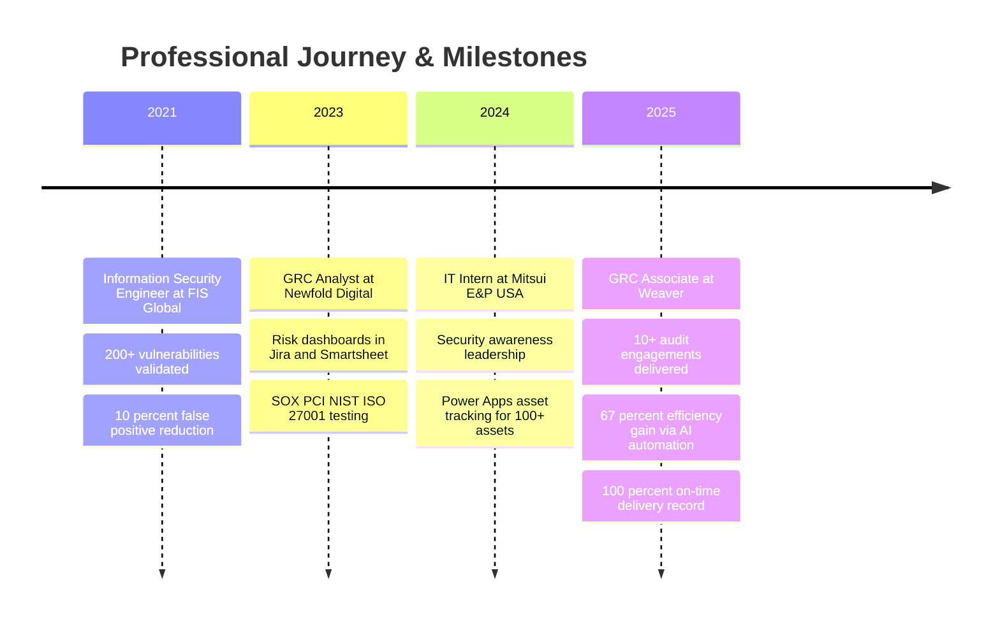

<!-- 
███████╗ █████╗ ██╗   ██╗ █████╗ ██╗     ██╗    ███████╗ ██████╗ ███╗   ██╗ █████╗ ██╗    ██╗ █████╗ ███╗   ██╗███████╗
██╔════╝██╔══██╗╚██╗ ██╔╝██╔══██╗██║     ██║    ██╔════╝██╔═══██╗████╗  ██║██╔══██╗██║    ██║██╔══██╗████╗  ██║██╔════╝
███████╗███████║ ╚████╔╝ ███████║██║     ██║    ███████╗██║   ██║██╔██╗ ██║███████║██║ █╗ ██║███████║██╔██╗ ██║█████╗  
╚════██║██╔══██║  ╚██╔╝  ██╔══██║██║     ██║    ╚════██║██║   ██║██║╚██╗██║██╔══██║██║███╗██║██╔══██║██║╚██╗██║██╔══╝  
███████║██║  ██║   ██║   ██║  ██║███████╗██║    ███████║╚██████╔╝██║ ╚████║██║  ██║╚███╔███╔╝██║  ██║██║ ╚████║███████╗
╚══════╝╚═╝  ╚═╝   ╚═╝   ╚═╝  ╚═╝╚══════╝╚═╝    ╚══════╝ ╚═════╝ ╚═╝  ╚═══╝╚═╝  ╚═╝ ╚══╝╚══╝ ╚═╝  ╚═╝╚═╝  ╚═══╝╚══════╝
CISA-Certified Technology Audit & Information Security Risk Professional
-->

<div align="center">

</div>

```bash
┌─[sayali@security-terminal]─[~/professional_identity]
└──╼ $ whoami
SAYALI SANJAY SONAWANE
CISA-Certified Technology Audit & Information Security Risk Professional

┌─[sayali@security-terminal]─[~/career_metrics]
└──╼ $ ls -la achievements/
drwxr-xr-x  4+ years of elite security experience
drwxr-xr-x  10+ SOX/PCI/FDICIA/NIST audit engagements
-rw-r--r--  100% on-time audit delivery record
-rw-r--r--  67% reduction in manual review time through AI automation
-rw-r--r--  200+ security vulnerabilities validated and remediated
-rw-r--r--  10% improvement in false-positive detection accuracy

┌─[sayali@security-terminal]─[~/specialization]
└──╼ $ cat expertise.txt
Technology Audit | IT General Controls (ITGC) | Application Security
SDLC Reviews | Risk Assessment | AI-Powered Automation | Data Analytics
```

<div align="center">

<table>
<tr>
<td></td>
<td></td>
<td></td>
</tr>
</table>

[](http://www.linkedin.com/in/sonawanesayali/)
[](https://github.com/ssonawanesayali)
[](https://github.com/ssonawanesayali)

</div>

---

## 🎯 PROFESSIONAL IDENTITY

I am a **CISA-certified Technology Audit and Information Security Risk professional** with over **4 years of specialized experience** in IT General Controls assessments, application security reviews, SDLC evaluations, and comprehensive security risk analysis. My expertise bridges the critical intersection of **compliance frameworks** (SOX ITGC, PCI DSS, FDICIA, NIST, ISO 27001), **security engineering**, and **AI-powered automation**, enabling organizations to strengthen their control environments while dramatically improving audit efficiency and governance visibility.

Throughout my career, I have executed **10+ end-to-end technology audit engagements** covering IT SOX, PCI DSS compliance, FDICIA regulatory requirements, and ISO 27001 certifications, consistently delivering **100% on-time completion** of audit milestones. My work spans evaluating IT General Controls by analyzing complex workflows, approval mechanisms, system-generated evidence, and underlying technology architectures that support mission-critical business processes. I specialize in performing application control and SDLC reviews by dissecting development-to-production workflows, identifying control gaps in change management, access provisioning, and segregation of duties, and strengthening control reliability across the software development lifecycle.

What sets my approach apart is my commitment to **innovation in audit methodology**. I have leveraged AI and workflow automation technologies to streamline audit testing and evidence evaluation processes, achieving a **67% reduction in manual review time** and enabling faster completion of audit fieldwork without sacrificing quality. This technological fluency extends to developing automated asset-tracking solutions using **Power Apps** and **Power Automate**, improving audit readiness and evidence visibility across **100+ technology assets**.

My security engineering background provides a unique advantage in technology audit work. With hands-on experience assessing and validating **200+ security vulnerabilities** using tools like **Rapid7**, **Qualys**, and **CVSS scoring frameworks**, I reduced false positives by **10%** and improved risk reporting accuracy. I have evaluated operating effectiveness of vulnerability management controls, conducted PCI-aligned vulnerability validation, performed incident investigations using log analysis to identify root causes, and assessed IAM controls and service account authentication to reduce access-related risks.

I communicate complex technology risks, control deficiencies, and remediation recommendations effectively to both business and technology stakeholders, accelerating issue resolution and improving governance visibility. My work directly supports organizations in strengthening their security posture, meeting regulatory requirements, and building resilient control environments that protect critical assets and data.



---

## 🧰 SKILLS

**Technology Audit & Controls:** Internal Audit | Technology Audit | IT General Controls (ITGC) | Application Controls | SDLC Reviews | Control Design Assessment | Operating Effectiveness Testing | Segregation of Duties (SoD)

**Risk & Governance:** Technology Risk Assessment | Information Security Risk Assessment | Audit Planning & Fieldwork | Audit Reporting | Issue Remediation | Third-Party Risk Management (TPRM)

**Security & Infrastructure:** IAM | Access Management | Change Management | Vulnerability Management | Application Security | Network Security Controls | System Architecture | Database & Operating System Fundamentals

**Data & Automation:** SQL | Python | Audit Analytics | AI-Powered Automation | Workflow Automation | Data Analytics

**Frameworks & Compliance:** SOX ITGC | FDICIA | PCI DSS | NIST | ISO 27001 | HIPAA | FFIEC

**Tools:** AuditBoard | FieldGuide | CCH | Jira | Smartsheet | Rapid7 | Qualys | Power Apps | Power Automate

---

## 💼 PROFESSIONAL EXPERIENCE

<table width="100%">
<tr>
<td width="50%" valign="top">

### 🚀 Governance, Risk & Compliance Associate
**`Weaver • July 2025 - Present`**

 

Executing comprehensive technology audit and IT control testing across **10+ client engagements** covering IT SOX, PCI DSS, FDICIA, NIST, and ISO 27001 frameworks, achieving **100% on-time delivery** of all audit milestones.

**Key Achievements:**
- Evaluated IT General Controls by analyzing complex workflows, approval logs, and system-generated evidence supporting critical business processes
- Performed application control and SDLC reviews by evaluating development-to-production workflows, identifying control gaps, and strengthening control reliability
- **Leveraged AI and workflow automation** to streamline audit testing and evidence evaluation, reducing manual review time by **67%** and enabling faster audit fieldwork completion
- Communicated technology risks, control deficiencies, and remediation recommendations to business and technology stakeholders, accelerating issue resolution and improving governance visibility
- Assessed control design and operating effectiveness across access management, change management, segregation of duties, and system architecture domains

**Technology Stack:** IT SOX | PCI DSS | FDICIA | NIST | ISO 27001 | AI Automation | AuditBoard | FieldGuide | CCH

</td>
<td width="50%" valign="top">

### 🛡️ IT Intern
**`Mitsui E&P USA LLC • May 2024 - August 2024`**

 

Led security awareness initiatives and developed automated asset management solutions to strengthen organizational security posture and improve audit readiness.

**Key Achievements:**
- Led security awareness initiatives, strengthening employee security practices and reducing human-related security risk across the organization
- **Developed an automated asset-tracking solution** using **Power Apps** and **Power Automate**, improving audit readiness and evidence visibility across **100+ technology assets**
- Enhanced IT asset inventory management processes, enabling real-time tracking and compliance reporting
- Collaborated with IT and security teams to identify process improvement opportunities and implement automation workflows

**Technology Stack:** Power Apps | Power Automate | Security Awareness Training | Asset Management | Process Automation

</td>
</tr>
</table>

<table width="100%">
<tr>
<td width="50%" valign="top">

### 📊 Governance, Risk & Compliance Analyst
**`Newfold Digital • February 2023 - August 2023`**

 

Executed risk-based testing of application and infrastructure controls aligned with SOX, PCI DSS, NIST, and ISO 27001 requirements, strengthening compliance posture and reducing remediation timelines.

**Key Achievements:**
- Executed risk-based testing of application and infrastructure controls aligned with **SOX, PCI DSS, NIST, and ISO 27001** requirements, strengthening compliance posture
- **Developed risk metrics, dashboards, and reporting workflows** in **Jira** and **Smartsheet**, enabling real-time visibility into control effectiveness for leadership and audit teams
- Collaborated with control owners and technology stakeholders to evaluate control effectiveness, validate remediation actions, and improve audit readiness
- Reduced remediation timelines through proactive control monitoring and stakeholder engagement
- Maintained comprehensive documentation of control testing procedures, findings, and remediation tracking

**Technology Stack:** SOX | PCI DSS | NIST | ISO 27001 | Jira | Smartsheet | Risk Dashboards | Control Testing

</td>
<td width="50%" valign="top">

### 🔒 Information Security Engineer
**`FIS Global • May 2021 - January 2023`**

 

Assessed and validated security vulnerabilities, evaluated control effectiveness, and performed incident investigations to strengthen organizational security posture and reduce risk exposure.

**Key Achievements:**
- Assessed and validated **200+ security vulnerabilities** using **Rapid7**, **Qualys**, **CVSS scoring**, and manual analysis, reducing false positives by **10%** and improving risk reporting accuracy
- Evaluated operating effectiveness of vulnerability management controls and prioritized remediation based on **CVSS ratings**, exploitability, and business impact
- Performed **PCI-aligned vulnerability validation** and compliance support, ensuring controls met regulatory and audit requirements
- Conducted incident investigations using log analysis, identifying root causes and strengthening preventive and detective control effectiveness
- Assessed **IAM controls** and service account authentication, reducing access-related risk and improving segregation of duties compliance

**Technology Stack:** Rapid7 | Qualys | CVSS | PCI DSS | IAM | Incident Investigation | Log Analysis | Vulnerability Scanning

</td>
</tr>
</table>



---

## 🎓 ACADEMIC EXCELLENCE

<table width="100%">
<tr>
<td width="50%" valign="top">

### 🎓 Master of Science
**Information Technology & Management**  
**`The University of Texas at Dallas`**


**Relevant Coursework:**
- Information Security Management
- IT Risk Assessment & Compliance
- Database Systems & Data Analytics
- Systems Analysis & Design
- Enterprise Architecture

**Honors & Activities:**
- Advanced studies in security frameworks, risk assessment methodologies, and technology governance
- Applied research in AI-powered security automation and audit analytics

</td>
<td width="50%" valign="top">

### 🎓 Bachelor of Engineering
**Electronics & Telecommunications**  
**`Savitribai Phule Pune University`**


**Relevant Coursework:**
- Computer Networks &